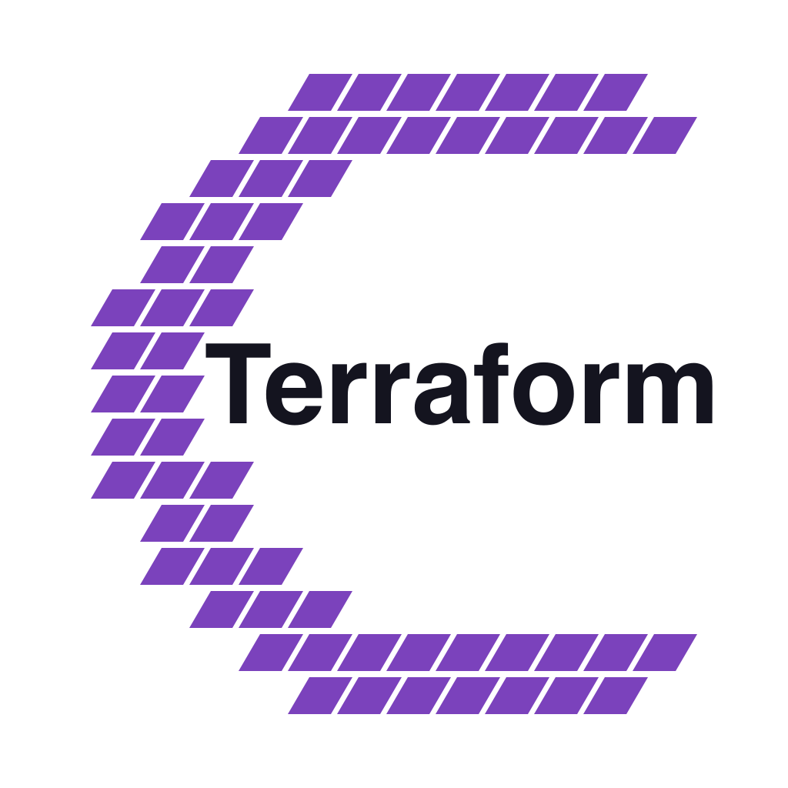

<p align="center">
  
</p>

# Terraform Provider for Coolify

[](https://registry.terraform.io/providers/coolify-terraform/coolify/latest)
[](https://search.opentofu.org/provider/coolify-terraform/coolify)
[](https://github.com/coolify-terraform/terraform-provider-coolify/actions/workflows/ci.yml)
[](https://www.bestpractices.dev/projects/13051)
[](https://scorecard.dev/viewer/?uri=github.com/coolify-terraform/terraform-provider-coolify)
[](https://github.com/coolify-terraform/terraform-provider-coolify/actions/workflows/fossa.yml)


Provision Coolify with Terraform. Manage applications, databases, servers, backups, and environment variables from versioned HCL instead of clicking through the UI.

## Start Here

- [Quick Start](docs/guides/quickstart.md) -- deploy your first app in under 5 minutes
- [Installation](docs/guides/installation.md) -- install and configure the provider
- [Examples](examples/) -- browse per-resource examples
- [Scenarios](examples/scenarios/) -- see full-stack ACME Corp setups tested against a real Coolify instance
- [Import Guide](docs/guides/import.md) -- adopt existing resources without rebuilding

## At a Glance

| Area | Coverage |
|---|---|
| Managed resources | 33 |
| Data sources | 44 |
| Tests | 880+ unit and acceptance tests |
| Scenario examples | 16 ACME Corp setups |
| Adoption path | New stacks and incremental import of existing Coolify resources |

## Demo

<p align="center">
  
</p>

A real `terraform apply` creating a project and deploying an nginx container to a Coolify server. Use the Coolify UI for visibility. Use Terraform for repeatable provisioning, reviewable changes, and disaster recovery.

## Quick Example

```hcl
terraform {
  required_providers {
    coolify = {
      source = "coolify-terraform/coolify"
    }
  }
}

provider "coolify" {
  endpoint = var.coolify_endpoint
  token    = var.coolify_token
}

resource "coolify_project" "example" {
  name = "acme-production"
}

resource "coolify_application" "api" {
  name           = "acme-api"
  project_uuid   = coolify_project.example.uuid
  server_uuid    = "your-server-uuid"
  git_repository = "https://github.com/example/acme-api"
  git_branch     = "main"
  build_pack     = "nixpacks"
  ports_exposes  = "3000"
  domains        = "https://api.example.com"
}
```

For a working end-to-end setup, start with the [Quick Start](docs/guides/quickstart.md), then explore [examples/](examples/) and [examples/scenarios/](examples/scenarios/).

## Why Teams Use It

- **Reproducibility** -- rebuild your stack after a failure, without hours of clicking in the UI
- **Version control** -- review infrastructure changes in pull requests before they hit production
- **Multi-environment consistency** -- stamp out matching dev, staging, and production environments from the same configuration
- **Safer collaboration** -- share `.tf` files instead of screenshots of Coolify settings
- **Gradual adoption** -- import existing resources and move toward Terraform without a full rebuild
- **Automation** -- integrate Coolify provisioning and deployment actions into your CI/CD workflow

## Guides

- [Core Concepts](docs/guides/concepts.md) -- understand the resource model
- [Choosing an Application Type](docs/guides/choosing-application-type.md) -- pick the right resource for your deployment method
- [Connecting Resources](docs/guides/connecting-resources.md) -- wire apps to databases using Coolify's Docker networking
- [Domains and HTTPS](docs/guides/domains-and-https.md) -- custom domains, automatic TLS, and URL redirects
- [Build Lifecycle](docs/guides/build-lifecycle.md) -- what happens after apply: build queuing, status, and deployment waiting
- [Secrets Management](docs/guides/secrets-management.md) -- handle passwords, tokens, and keys safely
- [Service Catalog](docs/guides/service-catalog.md) -- deploy one-click services (Plausible, Grafana, MinIO, etc.)
- [Docker Compose Stacks](docs/guides/docker-compose-services.md) -- deploy custom Docker Compose stacks with `coolify_service`
- [CI/CD Integration](docs/guides/cicd-integration.md) -- automate deployments with GitHub Actions or GitLab CI
- [Day-2 Operations](docs/guides/day-two-operations.md) -- upgrades, rollbacks, and disaster recovery
- [Common Errors](docs/guides/common-errors.md) -- error message reference with causes and fixes
- [Troubleshooting](docs/guides/troubleshooting.md) -- debugging tips and diagnostic logs
- [Migration from Community Provider](docs/guides/migration-from-community.md) -- switch from the SierraJC community provider

## Resources

| Resource | Description |
|----------|-------------|
| `coolify_project` | Manage projects (logical grouping for resources) |
| `coolify_server` | Register and configure servers |
| `coolify_server_hetzner` | Provision Hetzner Cloud servers via Coolify |
| `coolify_private_key` | Manage SSH keys for server access |
| `coolify_application` | Deploy apps from public Git repositories |
| `coolify_application_dockerfile` | Deploy apps from Dockerfiles |
| `coolify_application_docker_image` | Deploy apps from Docker images (Docker Hub, GHCR, etc.) |
| `coolify_application_private_git` | Deploy apps from private Git repos (SSH deploy key) |
| `coolify_application_github_app` | Deploy apps via GitHub App integration |
| `coolify_environment` | Manage project environments |
| `coolify_environment_variable` | Manage env vars for applications, services, and databases |
| `coolify_deployment` | Trigger application deployments |
| `coolify_service` | Deploy catalog services or custom Docker Compose stacks |
| `coolify_database_postgresql` | Provision PostgreSQL databases |
| `coolify_database_mysql` | Provision MySQL databases |
| `coolify_database_mariadb` | Provision MariaDB databases |
| `coolify_database_redis` | Provision Redis instances |
| `coolify_database_mongodb` | Provision MongoDB databases |
| `coolify_database_clickhouse` | Provision ClickHouse databases |
| `coolify_database_keydb` | Provision KeyDB databases (Redis-compatible) |
| `coolify_database_dragonfly` | Provision DragonFly databases (Redis-compatible) |
| `coolify_database_backup` | Schedule automated database backups |
| `coolify_scheduled_task` | Manage scheduled tasks on applications/services |
| `coolify_storage` | Manage persistent storage volumes |
| `coolify_cloud_token` | Manage cloud provider tokens (Hetzner) |
| `coolify_github_app` | Manage GitHub App integrations |
| `coolify_envs_bulk` | Manage environment variables as a single atomic set |
| `coolify_application_preview` | Manage application preview deployments |
| `coolify_api_settings` | Manage Coolify API and MCP server settings |
| `coolify_backup_execution` | Trigger database backup executions |
| `coolify_cloud_token_validate` | Validate cloud provider tokens |
| `coolify_resource_action` | Trigger start/stop/restart actions on resources |
| `coolify_server_validate` | Validate server SSH connectivity |

## Data Sources

| Data Source | Description |
|-------------|-------------|
| `coolify_project` / `coolify_projects` | Read project(s) |
| `coolify_server` / `coolify_servers` | Read server(s) |
| `coolify_server_resources` / `coolify_server_domains` | List resources and domains on a server |
| `coolify_server_validation` | Validate server connectivity |
| `coolify_private_key` / `coolify_private_keys` | Read SSH key(s) |
| `coolify_application` / `coolify_applications` | Read application(s) |
| `coolify_application_logs` | Read application logs |
| `coolify_database` / `coolify_databases` | Read database(s) |
| `coolify_environment` / `coolify_environments` | Read environment(s) |
| `coolify_environment_variable` / `coolify_environment_variables` | Read / list env vars for an application, service, or database |
| `coolify_deployment` / `coolify_deployments` | Read / list deployments for an application |
| `coolify_service` / `coolify_services` | Read service(s) |
| `coolify_scheduled_task` / `coolify_scheduled_tasks` / `coolify_task_executions` | Read scheduled task(s) and executions |
| `coolify_storage` / `coolify_storages` | Read / list persistent storage volumes |
| `coolify_cloud_token` / `coolify_cloud_tokens` | Read cloud token(s) |
| `coolify_github_app` / `coolify_github_apps` / `coolify_github_app_repositories` / `coolify_github_app_branches` | Read GitHub App(s), repos, branches |
| `coolify_backup_executions` | List backup execution history |
| `coolify_resources` | List all resources on a server |
| `coolify_team` / `coolify_teams` / `coolify_team_members` | Read team(s) and members |
| `coolify_health` | Read Coolify instance health status |
| `coolify_version` | Read the Coolify instance version |
| `coolify_hetzner_images` / `coolify_hetzner_locations` / `coolify_hetzner_server_types` / `coolify_hetzner_ssh_keys` | Read Hetzner cloud resources |

## What You Can Do

Deploy a full stack (app, database, backups, env vars) in a single `terraform apply`, or adopt the provider incrementally by importing your existing Coolify resources.

**Real-world scenarios included** -- 16 tested ACME Corp examples cover common patterns:

| Scenario | What it deploys |
|---|---|
| [acme-website](examples/scenarios/acme-website) | Project + PostgreSQL + web app + env vars |
| [acme-api](examples/scenarios/acme-api) | Dockerfile + Docker image apps + Redis + scheduled tasks + backups |
| [acme-backups](examples/scenarios/acme-backups) | Backup scheduling, S3 off-site storage, execution monitoring |
| [acme-multi-env](examples/scenarios/acme-multi-env) | Terraform modules for dev/staging environments |
| [acme-databases](examples/scenarios/acme-databases) | All 8 database engines side by side |
| [acme-platform](examples/scenarios/acme-platform) | Private keys, environments, storage, data sources |
| [acme-docker](examples/scenarios/acme-docker) | Docker image tag handling, scheduled tasks, storage |
| [acme-integrations](examples/scenarios/acme-integrations) | Managed services from the Coolify catalog |
| [acme-private-repo](examples/scenarios/acme-private-repo) | SSH deploy key + private Git repo + deployment with wait |
| [acme-team-ops](examples/scenarios/acme-team-ops) | Team management, server discovery, project inventory |
| [acme-day2-ops](examples/scenarios/acme-day2-ops) | Stop/start/restart resources with trigger-based re-execution |
| [acme-preview-deploy](examples/scenarios/acme-preview-deploy) | GitHub App + PR preview environments |
| [acme-github-cicd](examples/scenarios/acme-github-cicd) | GitHub App CI/CD pipeline with env vars + deployment |
| [acme-compose-git](examples/scenarios/acme-compose-git) | Custom Docker Compose stack via docker_compose_raw |
| [acme-env-scale](examples/scenarios/acme-env-scale) | Bulk env var management with shared + per-app patterns |
| [acme-hetzner-infra](examples/scenarios/acme-hetzner-infra) | Hetzner Cloud server provisioning + build server |

Every scenario has `terraform test` integration tests that run against a real Coolify instance.

## Features

- **Import existing resources** -- bring your current Coolify setup under Terraform management without rebuilding ([guide](docs/guides/import.md))
- **Configurable timeouts** -- handle slow builds gracefully (`timeouts = { create = "30m" }`)
- **Input validation** -- catch mistakes at plan time (invalid UUIDs, bad cron expressions, out-of-range ports)
- **Connection health check** -- the provider validates your API connection before making any changes
- **Reliable API calls** -- automatic retry with exponential backoff on transient failures (429, 5xx, network errors)
- **FIPS 140-3 cryptography** -- release binaries include the Go native FIPS module (CMVP #5247), enabled by default ([details](docs/guides/installation.md#fips-140-3-cryptography))

## Requirements

- [Terraform](https://www.terraform.io/downloads.html) >= 1.6 or [OpenTofu](https://opentofu.org/) >= 1.6
- [Go](https://golang.org/doc/install) >= 1.26 (for building from source)
- A running [Coolify](https://coolify.io/) instance (v4.x)

The provider is built on the [Terraform Plugin Framework](https://developer.hashicorp.com/terraform/plugin/framework), which implements the standard gRPC plugin protocol. All `terraform` commands in this documentation work identically with `tofu`.

## Extended Example

The quick example above shows the minimal provider shape. This example adds a database and shows how a fuller stack links resources together.

```hcl
terraform {
  required_providers {
    coolify = {
      source = "coolify-terraform/coolify"
    }
  }
}

provider "coolify" {
  endpoint = "https://your-coolify-instance"
  token    = "your-api-token"
}

resource "coolify_project" "example" {
  name        = "my-project"
  description = "Managed by Terraform"
}

resource "coolify_database_postgresql" "db" {
  name          = "my-database"
  project_uuid  = coolify_project.example.uuid
  server_uuid   = "your-server-uuid"
  image         = "postgres:16"
  postgres_user = "app"
  postgres_db   = "myapp"
  # postgres_password omitted here. The provider stores the generated
  # sensitive value in Terraform state after create.
}

resource "coolify_application" "web" {
  name           = "my-web-app"
  project_uuid   = coolify_project.example.uuid
  server_uuid    = "your-server-uuid"
  git_repository = "https://github.com/example/app"
  git_branch     = "main"
  build_pack     = "nixpacks"
  ports_exposes  = "3000"
  domains = "https://app.example.com"
}
```

See the [examples/](examples/) directory for per-resource examples (including
sensitive variable handling for
[`coolify_database_postgresql`](examples/resources/coolify_database_postgresql/resource.tf)
and [`coolify_github_app`](examples/resources/coolify_github_app/resource.tf)),
and the [ACME Corp scenarios](#what-you-can-do) above for full-stack examples.

## Authentication

The provider requires a Coolify API token. Coolify's API is disabled by default, so first enable it in the Coolify UI under **Settings**. Then generate a token under **Security > API Tokens**. Otherwise provider operations fail with `Unauthenticated`.

| Attribute | Environment Variable | Description |
|-----------|---------------------|-------------|
| `endpoint` | `COOLIFY_ENDPOINT` | Coolify API base URL |
| `token` | `COOLIFY_TOKEN` | API bearer token |

## Development

Install the local prerequisites, then bootstrap the repo-managed tools before
running the commands below:

- Python 3.9+

```bash
make tools         # Install CI-pinned local tools into ./bin
make acc-bootstrap # After local Coolify containers are running, prepare token/server/S3 fixtures
make acc-preflight # Verify required env, API reachability, and optional acceptance fixtures
```

`make tools` installs the pinned local versions of `golangci-lint`,
`goreleaser`, and `tfplugindocs` used by the repo workflows. `make acc-bootstrap`
wraps the supported [`scripts/setup-coolify-test.sh`](scripts/setup-coolify-test.sh)
helper and prints the `COOLIFY_*` exports to copy into your shell once the
local Coolify instance is up. `make acc-preflight` checks the required
acceptance environment, confirms the API is reachable, validates any
user-supplied `COOLIFY_SERVER_UUID` against `/api/v1/servers`, and warns when
optional fixtures are still missing. See [CONTRIBUTING.md](CONTRIBUTING.md)
for full local setup details, and run `make help` to list the supported local
targets from [GNUmakefile](GNUmakefile).

```bash
make build                                      # Compile the provider
make test                                       # Run unit tests (880+ tests, race detector enabled)
make test-pkg PKG=./internal/service/project/   # Run one package with repo-standard unit-test flags
make testacc-pkg PKG=./internal/service/project/ # Run one package with serialized repo-standard acceptance-test flags
make testacc                                    # Run acceptance tests with serialized package and in-package execution
make lint                                       # Run golangci-lint
make fmt                                        # Format code (gofmt + go mod tidy)
make docs                                       # Regenerate documentation via tfplugindocs
make validate                                   # Check HCL formatting in examples/
make python-test                                # Run Python unit tests for scripts/
make install                                    # Install provider to local Go bin
make ci                                         # Run the aggregate local checks (includes python-test; acceptance tests run separately)
```

`make ci` does not run acceptance tests. If your change touches real Coolify
API behavior, run `make acc-preflight` first, then `make testacc` or
`make testacc-pkg PKG=...`.

Required acceptance env vars are `COOLIFY_ENDPOINT` and `COOLIFY_TOKEN`.
`COOLIFY_SERVER_UUID` is an optional override, but `make acc-preflight`
expects it to be returned by `/api/v1/servers`. Otherwise the acceptance
helpers use the first visible server returned by the API. Optional fixture
gates are: `COOLIFY_HETZNER_TOKEN` for cloud token and Hetzner packages,
`COOLIFY_S3_STORAGE_UUID` for S3 backup coverage, and `COOLIFY_GITHUB_APP_*`
for the GitHub App application acceptance test.

Application acceptance tests also need a validated visible server with SSH
access. For local provider testing with `dev_overrides`, acceptance test setup,
and project structure details, see [CONTRIBUTING.md](CONTRIBUTING.md) and
[TESTING.md](TESTING.md).

### CI Pipeline

8 jobs in the CI workflow: Detect Changes, Test, Lint, Validate (includes
examples, docs, Trivy, Gitleaks), Scenario Tests, Acceptance Tests,
Contract Freshness (weekly), and a CI gate job.

## Troubleshooting

Enable provider debug logging to diagnose issues:

```bash
# Debug level: CRUD operations and state changes
TF_LOG_PROVIDER=DEBUG terraform plan

# Trace level: full HTTP request/response logging
TF_LOG_PROVIDER=TRACE terraform plan
```

Sensitive fields in structured JSON payloads, including passwords, tokens,
private keys, and environment variable values, are automatically redacted in
log output. Non-JSON bodies are omitted. See the
[Troubleshooting Guide](https://registry.terraform.io/providers/coolify-terraform/coolify/latest/docs/guides/troubleshooting)
for details.

## License

MPL-2.0